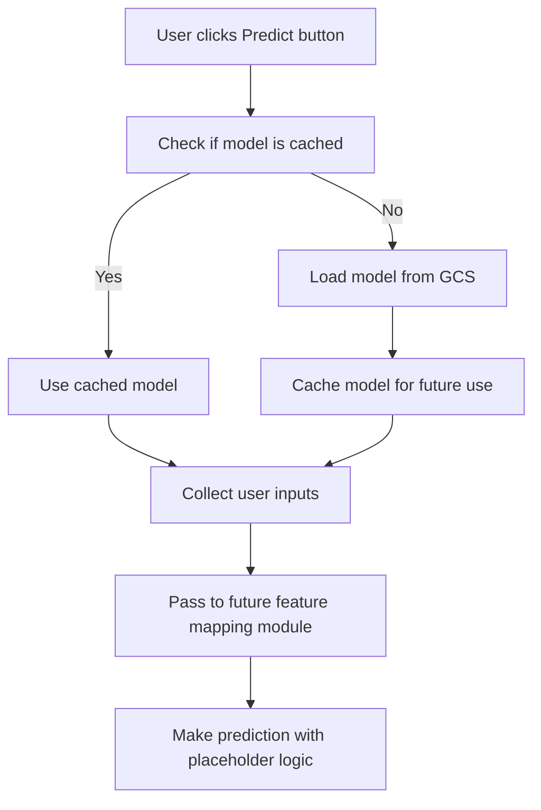
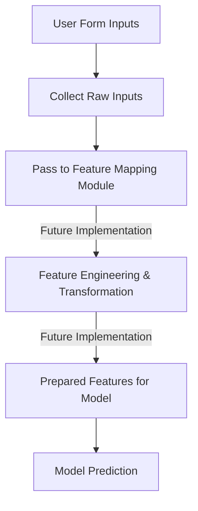

# HDB Price Predictor: Implementation Plan

## Overview

This document outlines the plan for enhancing the HDB Price Predictor web application with:
1. Google Cloud Storage (GCS) integration for model loading
2. Preparation for future input mapping to model features
3. UI/UX improvements

## 1. GCS Model Loading Implementation

We'll implement the GCS model loading functionality that triggers when the predict button is clicked:



### Key Implementation Details:

1. **Model Loading Function**:
   - Load the model only when the predict button is clicked (if not already cached)
   - Store at `is3107-project-bucket/models/hdb_xgb_model.json`
   - Implement proper error handling and loading states
   - Cache the model in memory for subsequent predictions

2. **Authentication**:
   - Use the existing service account credentials file
   - Implement secure credential handling

## 2. Input Collection & Future Mapping Preparation

We'll clearly structure the code to accommodate the future implementation of input mapping:



### Implementation Approach:

1. **Clear Module Structure**:
   - Create a dedicated module/function for feature mapping that will be implemented in the future
   - Add detailed comments explaining what this module will do
   - Include the list of required model features as a reference

2. **Input Collection**:
   - Ensure all necessary user inputs are collected from the form
   - Structure the data in a way that will be easy to process in the future

3. **Placeholder Implementation**:
   - For now, use the existing simulation logic for predictions
   - Add clear comments indicating where the future implementation will replace this logic

## 3. Code Structure for modelService.ts

```typescript
// Imports
import { Storage } from '@google-cloud/storage';

// Configuration
const BUCKET_NAME = 'is3107-project-bucket';
const MODEL_PATH = 'models/hdb_xgb_model.json';
const CREDENTIALS_PATH = '/is3107-project-457501-4f502924c0f9.json';

/**
 * List of features required by the pretrained model.
 * This serves as documentation for the future implementation of feature mapping.
 */
const REQUIRED_MODEL_FEATURES = [
  'month', 'town', 'flat_type', 'floor_area_sqm', 'flat_model', 
  'lease_commence_date', 'resale_price', 'years_from_lease', 
  'remaining_lease_months', 'year', 'latitude', 'longitude', 
  'average_close', 'unemployment_rate', 'nearest_school_cluster', 
  'school_count', 'sap_ind_pct', 'autonomous_ind_pct', 'gifted_ind_pct', 
  'ip_ind_pct', 'primary_schoool_count', 'distance_to_nearest_school', 
  'nearest_mrt_cluster', 'distance_to_nearest_mrt', 
  // One-hot encoded features
  'flat_type_1 ROOM', 'flat_type_2 ROOM', 'flat_type_3 ROOM', 
  'flat_type_4 ROOM', 'flat_type_5 ROOM', 'flat_type_EXECUTIVE', 
  'flat_type_MULTI-GENERATION',
  // Many more one-hot encoded features for flat_model and town...
  'flat_age_at_resale', 'storey_mean', 'is_high_floor', 'is_big_unit', 
  'school_quality', 'region_East Region', 'region_North Region', 
  'region_North-East Region', 'region_Rest of Central Region', 
  'region_West Region', 'town_sales_freq'
];

export default {
  model: null,
  modelLoading: false,
  
  /**
   * Load model from Google Cloud Storage
   * This function will be called when the predict button is clicked
   * if the model is not already cached.
   */
  async loadModel() {
    if (this.model) {
      console.log('Using cached model');
      return true;
    }
    
    this.modelLoading = true;
    try {
      console.log('Loading model from GCS...');
      
      // In the actual implementation, this would:
      // 1. Initialize GCS client with credentials
      // 2. Download the model file from the bucket
      // 3. Load the model into memory
      
      // For now, we'll simulate loading
      await new Promise(resolve => setTimeout(resolve, 1000));
      
      this.model = true; // Placeholder for actual model
      this.modelLoading = false;
      return true;
    } catch (error) {
      console.error('Error loading model:', error);
      this.modelLoading = false;
      throw new Error('Failed to load model from Google Cloud Storage');
    }
  },
  
  /**
   * FUTURE IMPLEMENTATION: Map user inputs to model features
   * This function will be implemented in the future to transform
   * the raw user inputs into the features required by the model.
   * 
   * @param {Object} formData - Raw user inputs from the form
   * @returns {Object} - Features formatted for the model
   */
  mapInputsToModelFeatures(formData) {
    // =====================================================================
    // NOTE: This is a placeholder function that will be implemented later
    // =====================================================================
    
    console.log('Input mapping will be implemented in the future');
    console.log('Raw form data:', formData);
    console.log('Required model features:', REQUIRED_MODEL_FEATURES);
    
    // Return a placeholder object
    // In the future, this will return properly mapped features
    return formData;
  },
  
  /**
   * Predict HDB resale price based on user inputs
   * This function loads the model if needed, collects the user inputs,
   * and will pass them to the feature mapping module in the future.
   * 
   * @param {Object} formData - User inputs from the form
   * @returns {Object} - Prediction result
   */
  async predictPrice(formData) {
    try {
      // Ensure model is loaded
      if (!this.model) {
        await this.loadModel();
      }
      
      // =====================================================================
      // FUTURE IMPLEMENTATION: This is where the input mapping will happen
      // The raw form data will be transformed into the features required by the model
      // =====================================================================
      
      // This function call will be replaced with actual implementation in the future
      const modelFeatures = this.mapInputsToModelFeatures(formData);
      
      // =====================================================================
      // FUTURE IMPLEMENTATION: This is where the actual model prediction will happen
      // The mapped features will be passed to the model for prediction
      // =====================================================================
      
      // For now, we'll use the existing simulation logic
      
      // Simple formula based on key features (this is just a simulation)
      const basePrice = 400000;
      const areaFactor = formData.floor_area_sqm * 2000;
      const leaseFactor = formData.remaining_lease_months * 100;
      const storeyFactor = this.getStoreyFactor(formData.storey_range) * 20000;
      const townFactor = this.getTownFactor(formData.town) * 50000;
      const flatTypeFactor = this.getFlatTypeFactor(formData.flat_type) * 50000;
      
      // Add some randomness to simulate model variance
      const randomFactor = (Math.random() * 0.1 + 0.95);
      
      const predictedPrice = (basePrice + areaFactor + leaseFactor + storeyFactor + townFactor + flatTypeFactor) * randomFactor;
      
      // Calculate confidence interval (just for demonstration)
      const lowerBound = predictedPrice * 0.9;
      const upperBound = predictedPrice * 1.1;
      
      // Get similar properties (mock data)
      const similarProperties = this.getSimilarProperties(formData);
      
      // Get key factors affecting the price
      const factors = [
        { name: 'Floor Area', value: `${formData.floor_area_sqm} sqm`, impact: 'high' },
        { name: 'Remaining Lease', value: `${Math.floor(formData.remaining_lease_months / 12)} years ${formData.remaining_lease_months % 12} months`, impact: 'high' },
        { name: 'Town', value: formData.town, impact: 'medium' },
        { name: 'Flat Type', value: formData.flat_type, impact: 'medium' },
        { name: 'Storey Range', value: formData.storey_range, impact: 'medium' },
      ];
      
      return {
        price: predictedPrice,
        lowerBound,
        upperBound,
        factors,
        similarProperties
      };
    } catch (error) {
      console.error('Error predicting price:', error);
      throw new Error('Failed to predict HDB resale price');
    }
  }
}
```

## 4. UI/UX Enhancements

While implementing the GCS integration, we'll enhance the UI/UX:

1. **Clear User Communication**:
   - Add a message explaining that the model is being loaded from GCS
   - Implement clear loading indicators during model loading
   - Add a note that feature conversion will be handled in a future implementation

2. **Form Experience**:
   - Improve form validation with inline feedback
   - Enhance mobile responsiveness
   - Add tooltips explaining each field's purpose

3. **Results Display**:
   - Create a more visually engaging results section
   - Improve visualization of prediction factors

## 5. Implementation Steps

1. **Update modelService.ts**:
   - Implement GCS client integration
   - Add model caching mechanism
   - Create placeholder for future input mapping
   - Add detailed comments explaining the future implementation

2. **Enhance PredictionView.vue**:
   - Update the form to collect all necessary inputs
   - Improve loading states and user feedback
   - Add clear messaging about the future feature mapping

3. **Update App.vue and CSS**:
   - Improve responsive design
   - Enhance visual styling
